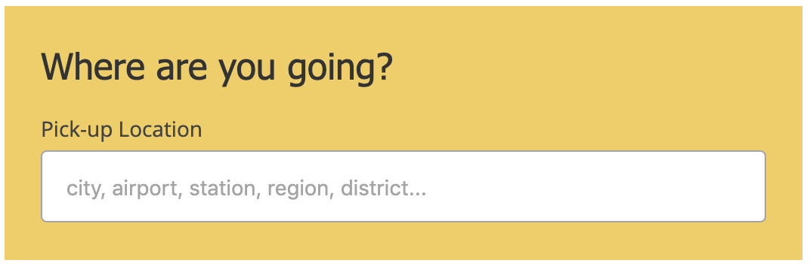
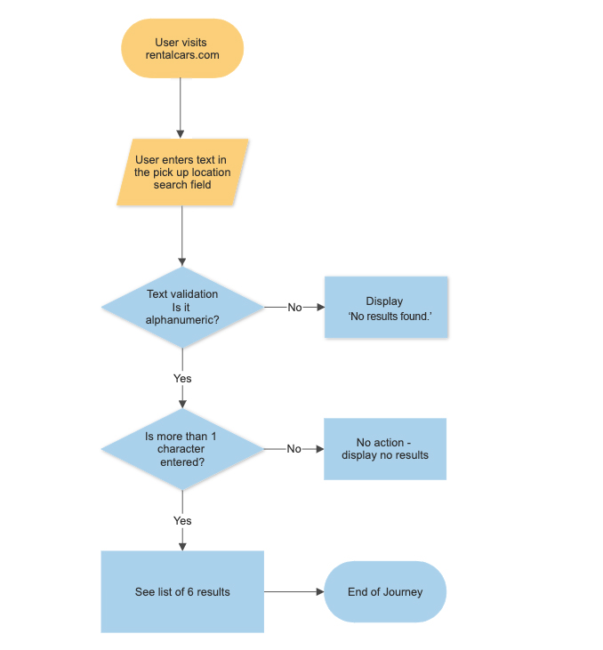
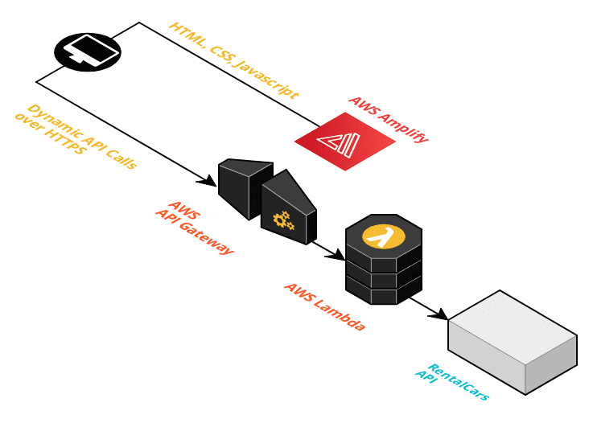
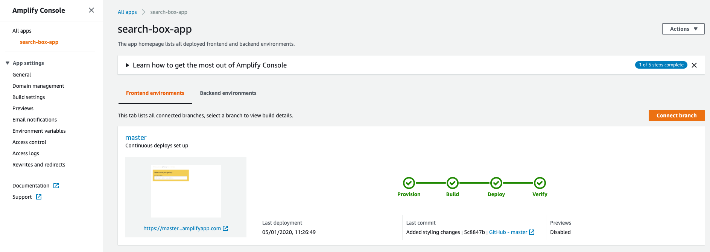
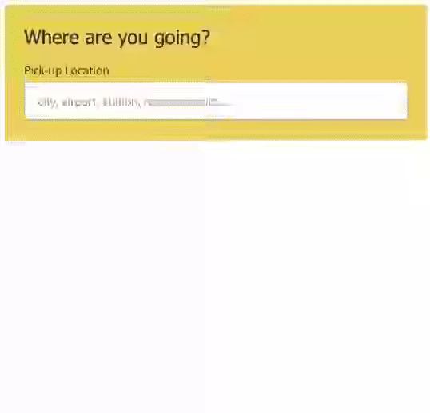

<h1 align="center">Search Box app</h1>  
<p align="center">
  ·
  <a href="https://master.d1soewjcun776i.amplifyapp.com/">View Demo</a>
  ·
</p>

## Table of Contents :book:

* [About](#about)
  * [Built With](#built-with)
* [Installation](#installation)
  * [Available scripts](#available-scripts)
* [Usage](#usage)
* [Technical Approach](#technical-approach)
  * [Initial steps](#initial-steps)
  * [Data Architecture](#data-architecture)
  * [Server Deployment](#server-deployment)
  * [Frontend Development](#frontend-development)
    * [Styling](#styling)
    * [Development](#development)
    * [Component architecture diagram](#component-architecture-diagram)
  * [Frontend Deployment](#frontend-deployment)
  * [Backend Considerations](#backend-considerations)
  * [Testing](#testing)
  * [Accessibility](#accessibility)
  * [QA Testing](#qa-testing)
* [Demo](#demo)

## About :star2:



Replica of the Rentalcars.com <em>Pick-up Location Search Widget</em> using the official live data endpoint.

### Built with :wrench:
The following tools and libraries were used

[](https://reactjs.org/) [](https://sass-lang.com/) [](https://graphql.org/) [](https://www.apollographql.com/) [](https://serverless.com/) [](https://aws.amazon.com/amplify/) [](https://jestjs.io/) [](https://airbnb.io/enzyme/)

## Installation :robot:

First you need to clone the repository and then run the rest of the commands to see it running locally

```sh
git clone https://github.com/vdelimpa/search-box-app.git
cd search-box-app
npm install
npm run start
```

#### Available scripts

Build the app locally

```
npm run build
```

Start app on localhost

```
npm run start
```

Test with coverage report

```
npm run test
```

## Usage :rocket:
Enter an alphanumeric location and get results regarding where you can pick-up your dream rental car!

## Technical Approach :triangular_ruler:
To fully understand the Pick-up location scenario, an initial flowchart was designed via [draw.io](https://draw.io)



#### Initial steps
After comprehending the user journey, [Postman](https://www.getpostman.com/) was used in order to make a GET request from the rentalcars.com endpoint and see the format of the data and make decisions around the best languages and frameworks for this project.

The returned data was too large for the required task, so [GraphQL](https://graphql.org/) was the go-to query language to be able to get just the data needed and not the whole JSON response.
___

#### Data Architecture
A server was setup locally using [GraphQL Apollo](https://www.apollographql.com/) following the schema definition creation which would be able to return the location name, region and country in the search results. This process was following a TTD approach in which the setup of the server and its expected data behavior were accessed via the [Jest testing framework](https://jestjs.io/).

When the server was made to respect the schema, query executions took place within the [Apollo Playground](https://www.apollographql.com/docs/apollo-server/getting-started/#step-8-execute-your-first-query) to test the GraphQL  responses.

##### [Deployed version of the server's playground on AWS](https://www.apollographql.com/docs/apollo-server/getting-started/#step-8-execute-your-first-query) :link:

##### GraphQL Query used

```sh
query Locations {
  locations(place: "athens") {
    name
    region
    country
  }
}
```

The [Apollo Client Developer Tools](https://chrome.google.com/webstore/detail/apollo-client-developer-t/jdkknkkbebbapilgoeccciglkfbmbnfm) for Google Chrome aswell as the Network tab were used in order to check the GraphQL calls that were made.
___

#### Server Deployment
After all the local tests were passing and the local Apollo GraphQL server were set, deployment took place. [AWS Amplify](https://aws.amazon.com/amplify/) and [Serverless](https://serverless.com/) made this part extremely easy as they help in connecting AWS cloud services directly to frontend enviroments. With a simple serverless config and an AWS account, the deployment took place on an AWS Lambda and resulted in exposing a live [AWS endpoint of the server](https://www.apollographql.com/docs/apollo-server/getting-started/#step-8-execute-your-first-query).

**New server deployment command**

```sh
serverless deploy
```

##### AWS Deployment Architecture



___

#### Frontend Development

##### Styling
With the help of the flowchart in terms of visualising the user journey and the elements examination of the rentalcars.com search box, the main UI structure was implemented in plain HTML in order to work as the basis of the app. The next step was to practice TTD and write tests regarding the visual component expected classes on these elements.

In order to see some results coming back from the basic UI that had been built at that point, mock data was used from the GraphQL response. This mock data was also used to write tests on the expected results based on the entered location. When the mock data prototype worked, real data was used from the [AWS deployed server](https://www.apollographql.com/docs/apollo-server/getting-started/#step-8-execute-your-first-query).

Next, styling took place with the help of [Sass](https://sass-lang.com/) in order to make the Search Box look like its live version. [Storybook](https://storybook.js.org/) was considered, however in such a small application it would have been an overkill.


##### Development
The best language for this user case seemed to be [React](https://reactjs.org/). React is used for creating interactive UIs. It also provides the ability to create reusable UI components with state, which respects data updates and renders only the components that are affected. It also communicates with GraphQL and the Apollo server perfectly, and AWS Amplify supports React applications.

TDD was also a strong part of this stage with the help of Jest and Enzyme. The initial HTML wireframe became a modularised set of components that were stored in a logical order within the src/ folder.

##### Component Architecture Diagram

todo

___


#### Frontend Deployment

[AWS Amplify]() makes it easy to deploy new changes, as it is linked to the repository of the app, on the master branch. So whenever there is a new commit, a new deployment gets fired automatically as part of the CI/CD services of AWS Amplify. See [AWS Deployment Architecture](#aws-deployment-architecture).



___

#### Backend Considerations
React Hooks were used in order to update state in the input field including **useQuery** and **useEffect**. The latter assisted in creating a React Hook which would debounce API calls to ensure that they don't execute too frequently.

When a user enters a location in the input box, the useEffect hook has been enhanced with a 500ms timer which only takes the value that will exist at the end of that timer, and will then make a GraphQL request with that value as the query variable for **place**. See the query [here](#graphql-query-used).

___

#### Testing

Throught the development of this project, TTD was applied to every step. Unit test using Jest and Enzyme were written to ensure the components behavior and states. Additionally custom hooks were also tested in order to make sure that each usage scenario would still work as expected. Snapshot and VRT tests were also added to test the component at a markup and visual level for changes.

___

#### Accessibility
todo

#### QA Testing
todo

#### Demo
  <a href="https://master.d1soewjcun776i.amplifyapp.com/">View Demo Live</a>

